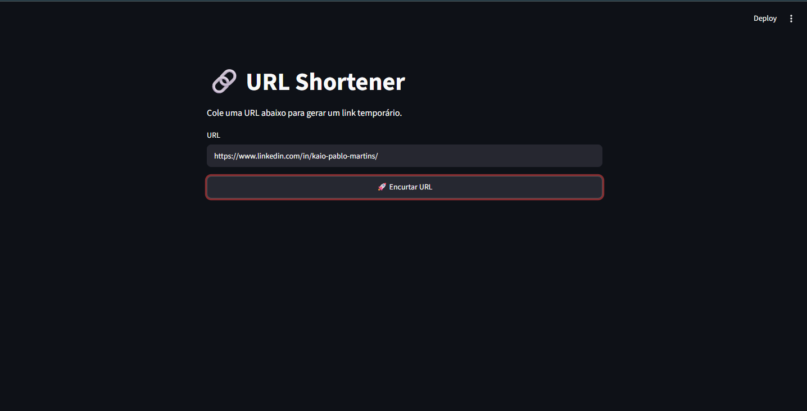
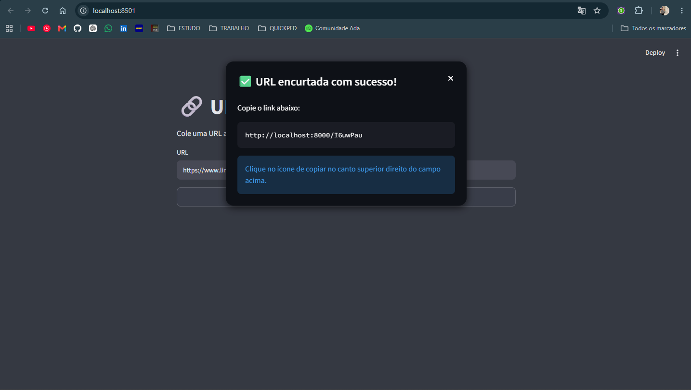

# URL Shortener

Um encurtador de URLs desenvolvido como desafio de arquitetura backend, com foco em separação de responsabilidades, baixa latência e uso consciente de tecnologias.

Ao contrário da abordagem tradicional, onde o banco de dados é responsável pelo armazenamento e validação dos links, este projeto utiliza o **Redis como armazenamento primário dos links ativos**, enquanto o **SQLite** é responsável apenas pela persistência dos metadados da geração.

---

# Objetivos

* Criar URLs encurtadas temporárias.
* Redirecionar rapidamente para a URL original.
* Utilizar expiração automática dos links.
* Manter histórico das URLs criadas.
* Demonstrar decisões arquiteturais e boas práticas de backend.

---

# Arquitetura

```text
                    Cliente
                       │
                       ▼
                  REST API
                       │
                ShortUrlService
                 ┌──────────────┐
                 │              │
                 ▼              ▼
              Redis         SQLite
          (links ativos)   (metadados)
```

---

# Fluxo de criação

1. O cliente envia uma URL.
2. A aplicação valida a URL recebida.
3. Um código curto é gerado.
4. Os metadados são persistidos no SQLite.
5. O link ativo é armazenado no Redis com TTL definido em .venv (padrão de 1 hora).
6. A API retorna a URL encurtada.

```text
POST /shorten

↓

Validação

↓

Geração do código

↓

SQLite (metadados)

↓

Redis (TTL 1 hora)

↓

Resposta
```

---

# Fluxo de redirecionamento

Quando um usuário acessa um link encurtado:

```text
GET /abc123

↓

Redis

↓

Existe?

├── Sim
│      ↓
│   HTTP 302 Redirect
│
└── Não
       ↓
410 Link expirado
```

O SQLite **não participa do fluxo de redirecionamento**, tornando esse caminho extremamente simples e rápido.

---

# Regra de negócio

Os links gerados são **temporários**.

Cada URL permanece disponível por padrão durante **1 hora**, podendo ser personalizado nas variáveis de ambiente do projeto.

Após esse período, o Redis remove automaticamente o registro utilizando TTL.

Uma vez expirado, o link deixa de existir e será necessário gerar um novo encurtamento.

---

# Responsabilidade de cada componente

## API

Responsável por:

* expor endpoints REST;
* validar requisições;
* retornar respostas HTTP.

---

## Service

Responsável por:

* validar URLs;
* gerar códigos curtos;
* coordenar operações entre Redis e SQLite;
* aplicar regras de negócio.

---

## Redis

Responsável por:

* armazenar os links ativos;
* controlar automaticamente sua expiração;
* responder às consultas de redirecionamento.

Exemplo:

```text
Key:
short:AbC123

Value:
https://www.google.com

TTL:
3600 segundos
```

---

## SQLite

Responsável apenas pela persistência dos metadados.

Exemplo:

| Campo        | Descrição                  |
| ------------ | -------------------------- |
| id           | Identificador              |
| original_url | URL original               |
| short_code   | Código gerado              |
| created_at   | Data de criação            |
| expires_at   | Data prevista de expiração |
| access_count | Quantidade de acessos      |

---

# Decisão arquitetural

Neste projeto o Redis **não é utilizado como cache**.

Ele é o armazenamento primário dos links ativos.

Essa escolha foi motivada pela própria regra de negócio:

* os links são temporários;
* a expiração faz parte do domínio;
* o Redis oferece TTL nativo;
* não há necessidade de jobs para limpeza de registros expirados;
* o fluxo de redirecionamento permanece extremamente rápido.

O SQLite atua apenas como persistência dos metadados e histórico de criação.

---

# Endpoints

## Criar URL

```http
POST /shorten
```

Request

```json
{
  "url": "https://google.com"
}
```

Response

```json
{
  "shortUrl": "http://localhost:8080/AbC123",
  "expiresAt": "2026-08-03T11:37:13.288549"
}
```

---

## Redirecionar

```http
GET /{code}
```

Resposta:

```
HTTP 302 Found
Location: https://google.com
```

---

# Estrutura do projeto

```text
.
├── app/
│   ├── api/
│   ├── core/
│   ├── db/
│   └── main.py
│
├── frontend/
│   └── app.py
│
├── docker/
│   ├── docker-compose.yml
│   ├── Dockerfile.api
│   └── Dockerfile.frontend
│
├── .env.example
├── requirements.txt
└── README.md
```

---

# Tecnologias

* Python
* FastAPI
* Redis
* SQLite
* Streamlit
* Docker
* Docker Compose

---

# Trade-offs

## Vantagens

* Fluxo de redirecionamento extremamente rápido.
* Expiração nativa utilizando TTL.
* Separação clara entre links ativos e histórico.
* Simplicidade da persistência utilizando SQLite.
* Fácil evolução para arquiteturas distribuídas.

## Limitações

* Os links são temporários por definição.
* Caso o Redis perca seus dados, todos os links ativos deixam de existir.
* O SQLite não foi escolhido visando alta concorrência, mas sim simplicidade para a primeira versão do projeto.

---

# Interface Web

Além da API REST, o projeto possui uma interface web desenvolvida com **Streamlit**, permitindo testar a aplicação de forma simples e intuitiva.

A interface possibilita:

- Inserir uma URL para encurtamento;
- Gerar um link temporário;
- Visualizar e copiar a URL encurtada;
- Consumir diretamente a API desenvolvida em FastAPI.

A interface foi criada exclusivamente para facilitar demonstrações e testes da aplicação.

---

# Demonstração

## Interface Web



## Link gerado



---

# Considerações finais

O objetivo deste projeto não é apenas implementar um encurtador de URLs, mas demonstrar como decisões arquiteturais podem ser tomadas a partir dos requisitos do domínio.

Ao utilizar o Redis como armazenamento primário dos links ativos e o SQLite exclusivamente para persistência dos metadados, a solução prioriza simplicidade, desempenho e separação de responsabilidades, mantendo espaço para evolução futura sem alterações significativas na regra de negócio.
